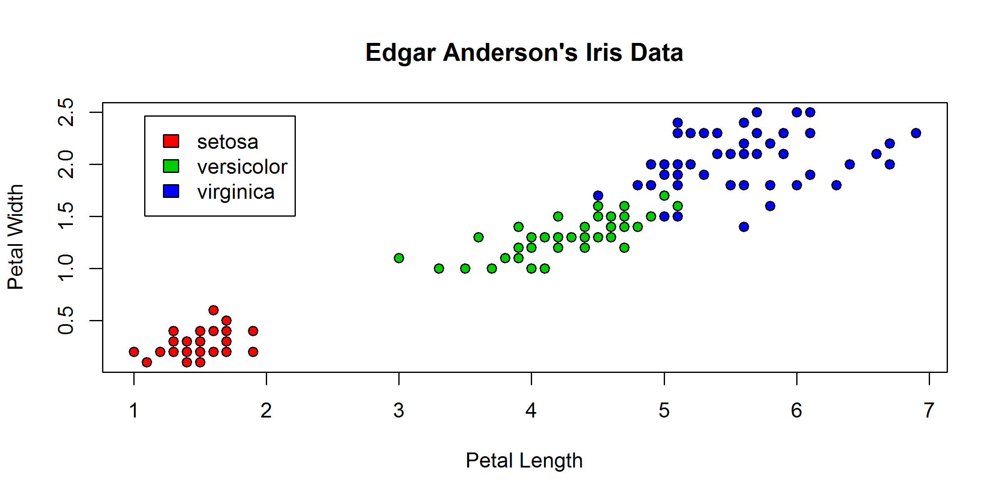
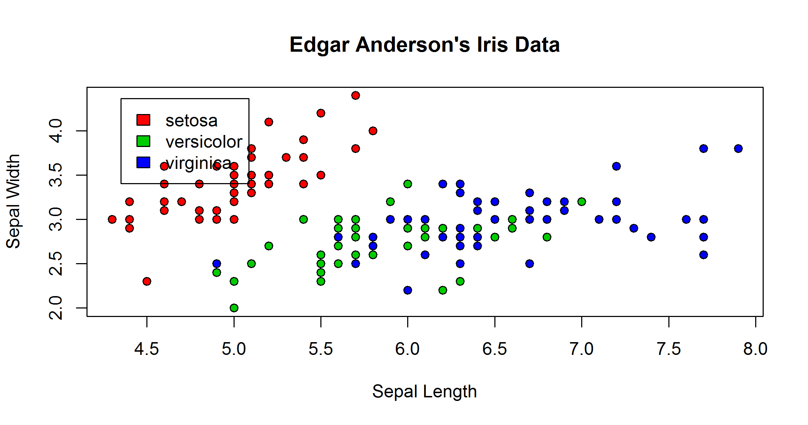
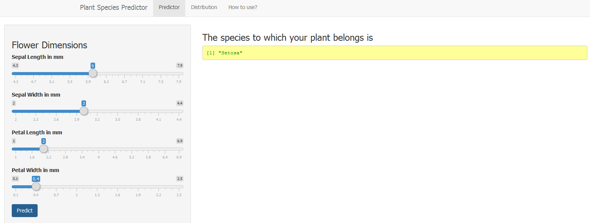

Plant Species Predictor
========================================================
author: Ajay
date: Tue Feb 17 16:20:16 2015
transition: rotate
width: 1920
height: 1080

Sepal and Petal Dimensions
========================================================

- The plant species predictor works by analyzing the dimensions of the sepals and petals of the flower.

- The features of the flower that are considered are
  - Sepal Length and Sepal Width
  - Petal Length and Petal Width
  
- The predictions are based on Edgar Anderson's `iris` dataset.

- The species that are considered are `setosa`, `versicolor` and `virginica`.

The data looks like this 


```r
summary(iris)
```

```
  Sepal.Length    Sepal.Width     Petal.Length    Petal.Width   
 Min.   :4.300   Min.   :2.000   Min.   :1.000   Min.   :0.100  
 1st Qu.:5.100   1st Qu.:2.800   1st Qu.:1.600   1st Qu.:0.300  
 Median :5.800   Median :3.000   Median :4.350   Median :1.300  
 Mean   :5.843   Mean   :3.057   Mean   :3.758   Mean   :1.199  
 3rd Qu.:6.400   3rd Qu.:3.300   3rd Qu.:5.100   3rd Qu.:1.800  
 Max.   :7.900   Max.   :4.400   Max.   :6.900   Max.   :2.500  
       Species  
 setosa    :50  
 versicolor:50  
 virginica :50  
                
                
                
```

 Edgar Anderson's iris
========================================================

Distribution of petals and sepals



 Edgar Anderson's iris
========================================================

Distribution of sepals




Prediction
========================================================


Something like this happens at the server.

```r
rfModel <- randomForest(Species~.,data=iris, ntree=100, importance=TRUE)
temp <- cbind(Sepal.Length, Sepal.Width, Petal.Length, Petal.Width)
predictedSpecies <- predict(rfModel, temp, type="class")
```


```
[1] "Setosa"
```
And, something like this appears in the UI.


